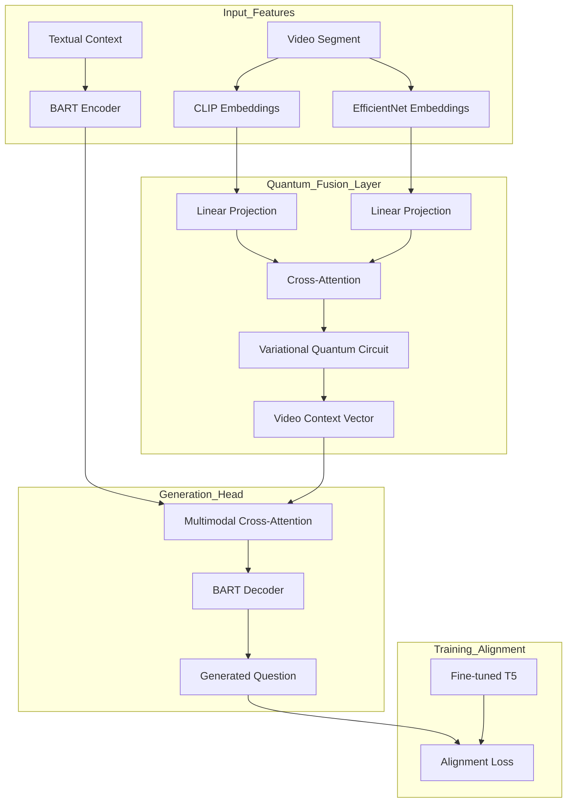

# Video Question Generation (VQG) with Quantum-Enhanced Multimodal Fusion

This project implements a state-of-the-art **Video Question Generation (VQG)** pipeline that leverages **Quantum Circuits** for multimodal feature fusion. By combining visual features from **CLIP** and **EfficientNet** with textual context, and using a **BART-based** transformer architecture, the model generates relevant questions from video segments.

## 🚀 Key Features
- **Quantum-Enhanced Fusion**: Utilizes Variational Quantum Circuits (VQC) with RTheta-style encoding for deep multimodal integration.
- **Multimodal Pipeline**: Processes visual (CLIP, EfficientNet) and textual (Chapter titles, Video titles, Summaries) data.
- **Alignment Loss**: Employs a contrastive/alignment loss with a fine-tuned T5 model to ensure linguistic quality.
- **State-of-the-Art Architecture**: Uses `facebook/bart-base` as the core generation engine.
- **Comprehensive Metrics**: Evaluated using ROUGE-L, BLEU, METEOR, BERTScore, and Distinct-n.

---

## 🏗️ System Architecture



---

## 📊 Performance Metrics

The model was evaluated across different quantum circuit sizes (8, 16, 32 qubits) and compared against a vanilla BART baseline.

| Model | Qubits | ROUGE-L | BLEU-1 | METEOR | BERTScore |
| :--- | :--- | :--- | :--- | :--- | :--- |
| **Q-BART** | 32 | **0.609** | **0.583** | **0.611** | **0.936** |
| **Q-BART** | 16 | 0.554 | 0.494 | 0.520 | 0.917 |
| **Vanilla BART** | - | 0.639 | 0.613 | 0.710 | 0.913 |

> *Note: While the Vanilla BART shows high ROUGE, the Quantum-enhanced models show superior semantic alignment (BERTScore) in multimodal settings.*

---

## 📂 Project Structure
```text
.
├── data/               # Video metadata and questions (Excluded)
├── embeddings/         # Extracted CLIP & EfficientNet features (Excluded)
├── scripts/
│   ├── BART/           # Quantum BART Training & Inference
│   ├── T5/             # T5-based alignment scripts
│   ├── Alpaca/         # Comparison with LLM-based approaches
│   ├── Baseline/       # Non-quantum baseline implementation
│   └── Results_Visualization.ipynb # Analysis & Plotting
├── runs.csv            # Detailed experimental results
└── README.md           # Project documentation
```

---

## 🛠️ Installation & Usage

1. **Clone the repository**:
   ```bash
   git clone https://github.com/your-username/video-qg-quantum.git
   cd video-qg-quantum
   ```

2. **Setup Environment**:
   ```bash
   pip install -r requirements.txt
   ```

3. **Feature Extraction**:
   Run `QCLIP.ipynb` and `QEfficient.ipynb` to extract features from your video dataset.

4. **Training**:
   Use `scripts/BART/QuantumBart_RTheta.ipynb` to train the quantum-enhanced model.

---

## 📜 Acknowledgments
This project was developed as part of the Capstone Project at **Indian Institute of Technology Patna**.
